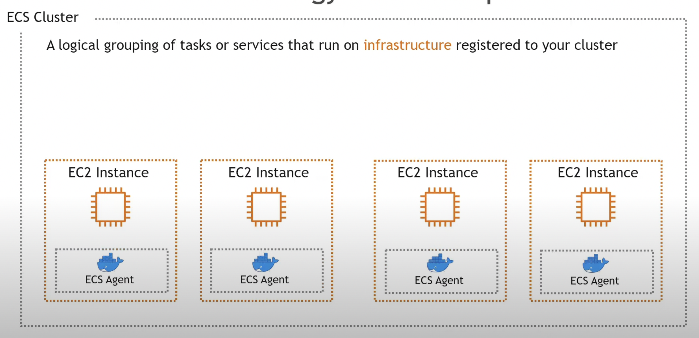

## ECS -- Infra 

### ECS workload Infra options 

## To Deploy any container image given stack is required 

# Task Definitions 

A task definition is a blueprint for your application. It is a text file in JSON format that describes the parameters and one or more containers that form your application.

## task Definition include couple of things 

<b>The following are some of the parameters that you can specify in a task definition </b>

- The launch type to use, which determines the infrastructure that your tasks are hosted on
- The Docker image to use with each container in your task
- How much CPU and memory to use with each task or each container within a task
- The memory and CPU requirements
- The operating system of the container that the task runs on
- The Docker networking mode to use for the containers in your task
- The logging configuration to use for your tasks
- Whether the task continues to run if the container finishes or fails
- The command that the container runs when it's started
- Any data volumes that are used with the containers in the task
- The IAM role that your tasks use

