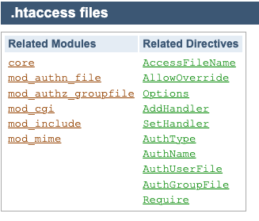

## getting started

### .HTACCESS   

<p> .htaccess files provide a way to make configuration changes on a per-directory basis </p>

### directory based configuration can be this 

```
/.htaccess
/www/.htaccess
/www/htdocs/.htaccess
/www/htdocs/example/.htaccess
```

### More info 



## implementing .htaccess

### having one virtualhosting 

```
[root@ip-172-31-14-54 conf.d]# pwd
/etc/httpd/conf.d
[root@ip-172-31-14-54 conf.d]# ls
README  acl.txt  autoindex.conf  htaccess.conf  userdir.conf  welcome.conf
[root@ip-172-31-14-54 conf.d]# cat  htaccess.conf 
<virtualhost *:80>
servername localhost
documentroot /var/www/html/
<directory /var/www/html/>
    Options Indexes FollowSymLinks
    AllowOverride All
    Require all granted
</directory>


</virtualhost>

```

### Now creating .htaccess in /var/www/html/

```
[root@ip-172-31-14-54 conf.d]# cat /var/www/html/.htaccess 
Options -Indexes
order allow,deny

# Denies all IP's
allow from all
Deny from localhost

Redirect 301 /main.html /test/index.html
ErrorDocument 404 /404.html


```


