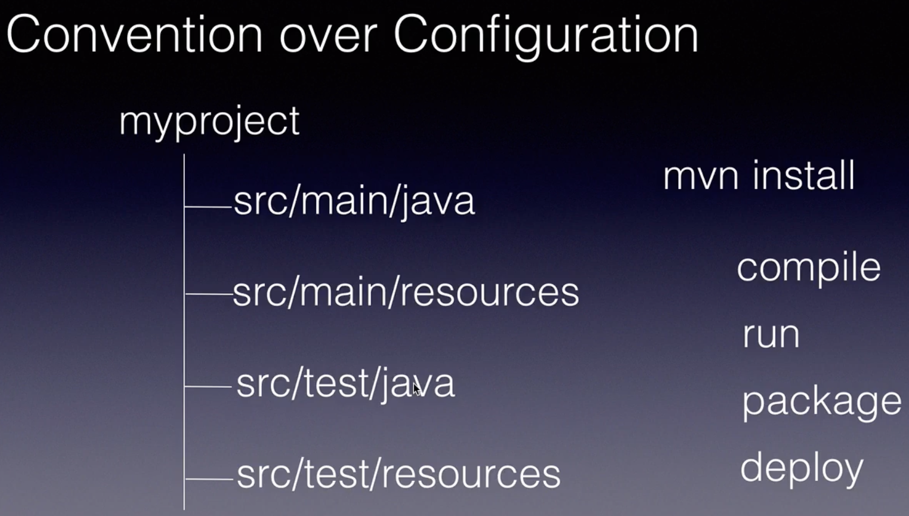
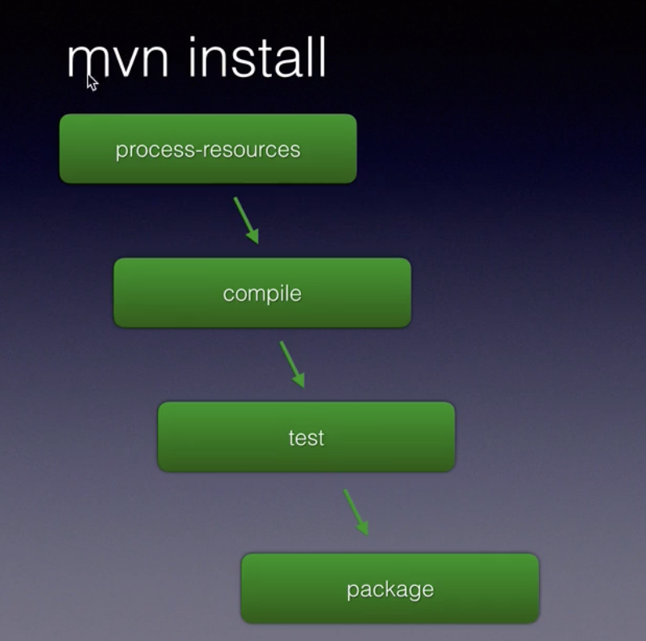

# Getting started with apache maven 

## Installing Maven on amazon-linux-2 

## Note: Minimum jdk 8 is required to install maven 

### Installing java 11 

```
  yum install java-11-amazon-corretto  -y
```

### Install maven maven-3.0.5-1

```
yum install maven -y
```

### Verify java and maven 

```
[root@ip-172-31-61-69 ~]# java --version 
openjdk 11.0.21 2023-10-17 LTS
OpenJDK Runtime Environment Corretto-11.0.21.9.1 (build 11.0.21+9-LTS)
OpenJDK 64-Bit Server VM Corretto-11.0.21.9.1 (build 11.0.21+9-LTS, mixed mode)

[root@ip-172-31-61-69 ~]# jps
4580 Jps

```

###

```
[root@ip-172-31-61-69 ~]# mvn --version 
Apache Maven 3.0.5 (Red Hat 3.0.5-17)
Maven home: /usr/share/maven
Java version: 11.0.21, vendor: Amazon.com Inc.
Java home: /usr/lib/jvm/java-11-amazon-corretto.x86_64
Default locale: en_US, platform encoding: ANSI_X3.4-1968
OS name: "linux", version: "5.10.205-195.804.amzn2.x86_64", arch: "amd64", family: "unix"
```

## Since maven is all java based project build and management tool 

### SO apache tomcat will be the server where we will deploy webapps by maven 

## setup apache tomcat in linux amazonlinux-2

### prerequisite 

<ol>
    <li> JDK8 or later </li>
      <li> tomcat binary  </li>
</ol>

### Downloading tomcat 10 package

```
cd /opt
 wget https://dlcdn.apache.org/tomcat/tomcat-10/v10.1.18/bin/apache-tomcat-10.1.18.tar.gz
tar xvzf apache-tomcat-10.1.18.tar.gz

===>> verify it

[root@ip-172-31-61-69 tomcat]# ls /opt/
apache-tomcat-10.1.18  apache-tomcat-10.1.18.tar.gz 
```

### Creating a directory and user so that we can run tomcat with non root user power

```
sudo useradd -m -U -d /opt/tomcat -s /bin/false tomcat
```

### Copy data to /opt/tomcat/

```
 cp -rf    /opt/apache-tomcat-10.1.18/*  /opt/tomcat/
```

### fixing permissions

```
 sudo chown -R tomcat: /opt/tomcat
 sudo sh -c 'chmod +x /opt/tomcat/bin/*.sh'
```

## now we can start/stop tomcat service

```
[root@ip-172-31-61-69 tomcat]# /opt/tomcat/bin/startup.sh 
Using CATALINA_BASE:   /opt/tomcat
Using CATALINA_HOME:   /opt/tomcat
Using CATALINA_TMPDIR: /opt/tomcat/temp
Using JRE_HOME:        /
Using CLASSPATH:       /opt/tomcat/bin/bootstrap.jar:/opt/tomcat/bin/tomcat-juli.jar
Using CATALINA_OPTS:   
Tomcat started.


====>>

[root@ip-172-31-61-69 tomcat]# /opt/tomcat/bin/shutdown.sh 
Using CATALINA_BASE:   /opt/tomcat
Using CATALINA_HOME:   /opt/tomcat
Using CATALINA_TMPDIR: /opt/tomcat/temp
Using JRE_HOME:        /
Using CLASSPATH:       /opt/tomcat/bin/bootstrap.jar:/opt/tomcat/bin/tomcat-juli.jar
Using CATALINA_OPTS:   

```

## Additional steps 

### setting env 

```
[root@ip-172-31-61-69 tomcat]# cat  /root/.bashrc 
# .bashrc

# User specific aliases and functions

alias rm='rm -i'
alias cp='cp -i'
alias mv='mv -i'

# Source global definitions
if [ -f /etc/bashrc ]; then
	. /etc/bashrc
fi


TOMCAT=/opt/tomcat
PATH=$PATH:$TOMCAT/bin/
export PATH

```

### outcome --

```
[root@ip-172-31-61-69 ~]# shutdown.sh 
Using CATALINA_BASE:   /opt/tomcat
Using CATALINA_HOME:   /opt/tomcat
Using CATALINA_TMPDIR: /opt/tomcat/temp
Using JRE_HOME:        /
Using CLASSPATH:       /opt/tomcat/bin/bootstrap.jar:/opt/tomcat/bin/tomcat-juli.jar
Using CATALINA_OPTS:

=====>>

[root@ip-172-31-61-69 ~]# 
[root@ip-172-31-61-69 ~]# startup.sh 
Using CATALINA_BASE:   /opt/tomcat
Using CATALINA_HOME:   /opt/tomcat
Using CATALINA_TMPDIR: /opt/tomcat/temp
Using JRE_HOME:        /
Using CLASSPATH:       /opt/tomcat/bin/bootstrap.jar:/opt/tomcat/bin/tomcat-juli.jar
Using CATALINA_OPTS:   
Tomcat started.

```

### Configure Apache Tomcat Application Manager

<p> You will only have access to the Tomcat default page by default. You must configure the admin and administrator user accounts to access admin and other parts such as Server Status, App Manager, and Host Manager. The two manager apps referenced in the next sections must be configured per our requirements.

We must update the Tomcat User XML file, <b> /opt/tomcat/conf/tomcat-users.xml, </b> to create the users and set their roles. Don’t forget to take the backup of the current file. You can execute the following command to take the backup: 
</p>

### setup 

```
sudo cp /opt/tomcat/conf/{tomcat-users.xml,tomcat-users.xml.bak}
sudo vim /opt/tomcat/conf/tomcat-users.xml

====> add given lines 
<role rolename="admin"/>
<role rolename="admin-gui"/>
<role rolename="manager"/>
<role rolename="manager-gui"/>
<user username="tomcat-admin" password="strongpassword" roles="admin,admin-gui,manager,manager-gui"/>
```

### Now allow managers to be accessible from outside 127.0.0.1

<p>
Then, comment out the following block of text in the Manager Context XML file <b> (/opt/tomcat/webapps/manager/META-INF/context.xml) and Host Manager Context XML file (/opt/tomcat/webapps/host-manager/META-INF/context.xml): </b>
</p>

### comment below kind of line both files

```
<Valve className="org.apache.catalina.valves.RemoteAddrValve" allow="127\.\d+\.\d+\.\d+|::1|0:0:0:0:0:0:0:1" />

```

### now it will look like 

```
<!-- <Valve className="org.apache.catalina.valves.RemoteAddrValve" allow="127\.\d+\.\d+\.\d+|::1|0:0:0:0:0:0:0:1" /> -->

```
# MAVEN -- Again 

### Creating a new project from command line

```
 mvn archetype:generate -DgroupId=com.example -DartifactId=mywebapp -DarchetypeArtifactId=maven-archetype-quickstart -DinteractiveMode=false
```

### below structure got created 

```
[ec2-user@ip-172-31-61-69 learning]$ tree 
.
`-- demo
    |-- pom.xml
    |-- src
    |   |-- main
    |   |   `-- java
    |   |       `-- com
    |   |           `-- example
    |   |               `-- App.java
    |   `-- test
    |       `-- java
    |           `-- com
    |               `-- example
    |                   `-- AppTest.java
    `-- target
        |-- classes
        |   `-- com
        |       `-- example
        |           `-- App.class
        `-- test-classes
            `-- com
                `-- example
                    `-- AppTest.class

17 directories, 5 files

```

### MVN INStall --  


#### When you run mvn install, Maven executes the following phases of the build lifecycle:

### validate: 
	-: Validate the project is correct and all necessary information is available.

### compile: 
	-: Compile the source code of the project.

### test: 
	-: Test compiled source code using appropriate testing frameworks.

### package: 
	:- Take the compiled code and package it in its distributable format, such as a JAR.

### install: 
	-: Install the package into the local repository for use as a dependency in other projects locally.

```
[ec2-user@ip-172-31-61-69 learning]$ cd demo/
[ec2-user@ip-172-31-61-69 demo]$ ls
pom.xml  src  target
[ec2-user@ip-172-31-61-69 demo]$ mvn install 
[INFO] Scanning for projects...
[INFO]                                                                         
[INFO] ------------------------------------------------------------------------
[INFO] Building demo 1.0-SNAPSHOT
[INFO] ------------------------------------------------------------------------


===>>
]  T E S T S
[INFO] -------------------------------------------------------
[INFO] Running com.example.AppTest
[INFO] Tests run: 1, Failures: 0, Errors: 0, Skipped: 0, Time elapsed: 0.053 s - in com.example.AppTest
[INFO] 
[INFO] Results:
[INFO] 
[INFO] Tests run: 1, Failures: 0, Errors: 0, Skipped: 0
[INFO] 

===>>
[INFO] Installing /home/ec2-user/learning/demo/pom.xml to /home/ec2-user/.m2/repository/com/example/demo/1.0-SNAPSHOT/demo-1.0-SNAPSHOT.pom
[INFO] ------------------------------------------------------------------------
[INFO] BUILD SUCCESS
[INFO] ------------------------------------------------------------------------
[INFO] Total time: 5.733s
[INFO] Finished at: Sat Jan 13 11:00:18 UTC 2024
[INFO] Final Memory: 15M/54M

```

### It generate jar file in target folder 

```
[ec2-user@ip-172-31-61-69 demo]$ ls
pom.xml  src  target
[ec2-user@ip-172-31-61-69 demo]$ 
[ec2-user@ip-172-31-61-69 demo]$ ls target/
classes  demo-1.0-SNAPSHOT.jar  generated-sources  generated-test-sources  maven-archiver  maven-status  surefire-reports  test-classes
[ec2-user@ip-172-31-61-69 demo]$ 

```

### to RUN jar file 

```
java -cp target/demo-1.0-SNAPSHOT.jar  com.example.App
Hello World!
[ec2-user@ip-172-31-61-69 demo]$ 

```

### MVN project architecture 




### MVN install -- lifecycle 



### Default repo URL 

```
https://repo.maven.apache.org/maven2/
```

### Note: When we install -- mvn install it pull the dependency in from official repo and put it in local repo for cache

### Local of local repo is 

```
[ec2-user@ip-172-31-61-69 ~]$ ls -a
.  ..  .bash_history  .bash_logout  .bash_profile  .bashrc  .cache  .m2  .redhat  .ssh  .viminfo  .vscode-server  learning
[ec2-user@ip-172-31-61-69 ~]$ cd .m2/
[ec2-user@ip-172-31-61-69 .m2]$ ls
repository
[ec2-user@ip-172-31-61-69 .m2]$ 


```

### Creating a mvn webapp project 

```
mvn archetype:generate -DgroupId=com.example -DartifactId=my-spring-app -DarchetypeArtifactId=maven-archetype-webapp -DarchetypeGroupId=org.apache.maven.archetypes -DinteractiveMode=false
[INFO] Scanning for projects...
[INFO]                                         
```

### Verify 

```
[root@ashu-linux my-spring-app]# ls
pom.xml  src

```
