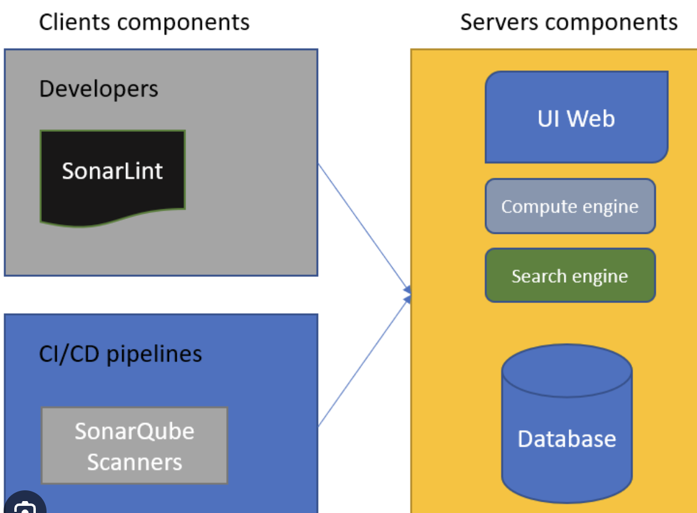
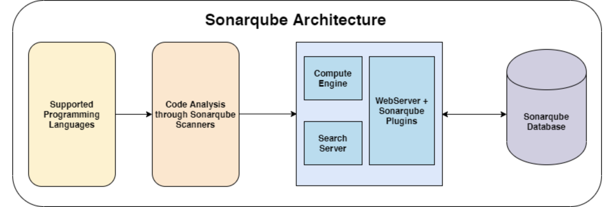

# poc

## basic info about 

# SonarQube: Open-Source Code Quality Platform
SonarQube is an open-source platform for continuous inspection of code quality. It helps developers identify bugs, code smells, vulnerabilities, code duplication, and potential improvements in coding standards.

Here's a quick overview of what SonarQube offers:

Static and Dynamic Code Analysis: SonarQube utilizes a combination of static and dynamic analysis techniques to provide a comprehensive view of code quality.
Detailed Reports: Generate reports on various aspects of your codebase, including code coverage, complexity, unit test effectiveness, potential bugs, and code duplication.
Integration with Development Tools: Integrate seamlessly with popular development tools like Maven and Jenkins for a smooth workflow.
External Tool Integration: Extend SonarQube's functionality by integrating with external tools like JIRA for issue tracking and LDAP for user management.
Plugin Ecosystem: Leverage a wide range of plugins to support various programming languages, frameworks, and quality gates.
Technical Debt Management: SonarQube calculates technical debt based on the SQALE methodology, helping you prioritize code improvements.
Benefits of using SonarQube:

Improve code quality and reduce bugs
Enforce coding standards and best practices
Increase developer productivity
Facilitate code reviews
Identify and prioritize technical debt
Getting Started with SonarQube:

SonarQube can be installed on your local machine or deployed on a server. The installation process typically involves creating a database schema and user.

## SonarQube architecture 



### a More visual look 



### sonarqube products


## How to scan a code with sonar 

```
sonar-scanner   -Dsonar.projectKey=ashu-project   -Dsonar.sources=./airtel-webapp   -Dsonar.host.url=http://23.22.16.681:9000   -Dsonar.token=""
```

