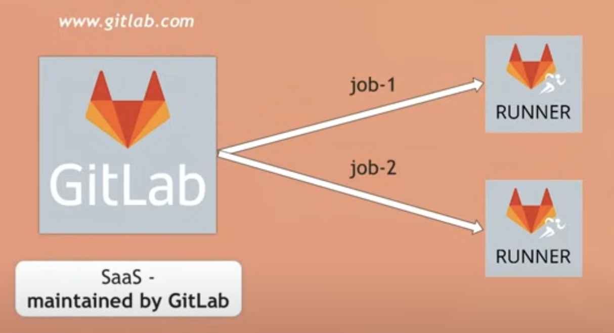
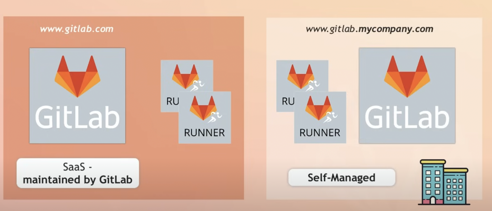

## GitLab -- One of the most popular CICD tool




### Note: -- 

<p> By Default gitlab offer shared runners where our job can run </p>

### Gitlab runners options 




## Gitlab pipeline 

### -- The name of the file under repo will be  {{ .gitlab-ci.yml }}

### sample ci.yaml with Single job 

```
## running sample job

first-job:
  script:
    - echo "hello world"
    - echo "default stage is test"
```

### sample ci.yaml with multiple job  

```
## running sample job

first-job:
  script:
    - echo "hello world"
    - echo "default stage is test"
  
python-code:
  script:
    - echo "running python code"
    - python3 hello.py 

```

## Note: Some Info about Job running 

<ol>
    <li> By default all jobs are running parallel under a default stage called test </li>  
    <li> to make then run sequential we need to define them in stages  </li>  
</ol>


## sample CI file using stages  


### CI.yaml  --- 
```
stages:          # List of stages for jobs, and their order of execution
  - build
  - test
  - deploy

build-job:       # This job runs in the build stage, which runs first.
  stage: build
  script:
    - echo "Compiling the code..."
    - echo "Compile complete."

unit-test-job:   # This job runs in the test stage.
  stage: test    # It only starts when the job in the build stage completes successfully.
  script:
    - echo "Running unit tests... This will take about 60 seconds."
    - sleep 60
    - echo "Code coverage is 90%"

lint-test-job:   # This job also runs in the test stage.
  stage: test    # It can run at the same time as unit-test-job (in parallel).
  script:
    - echo "Linting code... This will take about 10 seconds."
    - sleep 10
    - echo "No lint issues found."

deploy-job:      # This job runs in the deploy stage.
  stage: deploy  # It only runs when *both* jobs in the test stage complete successfully.
  environment: production
  script:
    - echo "Deploying application..."
    - echo "Application successfully deployed."

```

## Note: by default gitlabci.yaml has a predefine stage order given below 

<ol>
  <li> .pre </li>  ---> <i> always gonna run very  first </i>
   <li> build  </li>
   <li> test </li>
   <li> deploy </li>
   <li> .post </li> --- >  <i> always gonna run in the Last  </i>
</ol>

