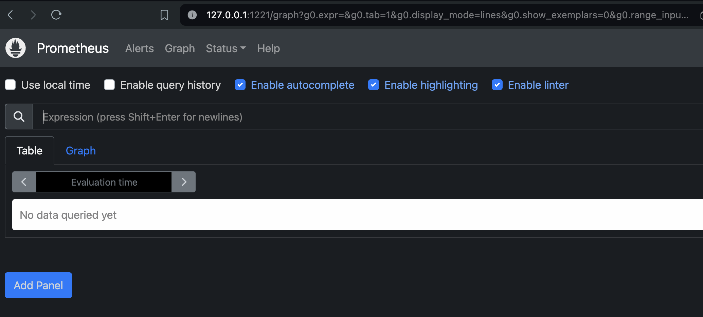
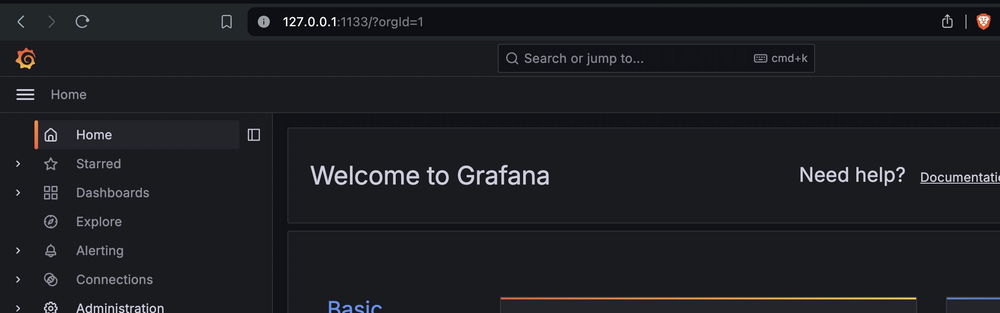

# Setup Prometheus & grafana stack in Kubernetes 

## Using Helm 

### adding helm repo  and verifying 

```
helm repo add  prometheus-community https://prometheus-community.github.io/helm-charts 
====>>
helm repo ls
NAME                	URL                                                     
prometheus-community	https://prometheus-community.github.io/helm-charts      
stable              	https://charts.helm.sh/stable        
```

###  creating namespace 

```
kubectl create namespace monitoring
namespace/monitoring created

```

### installing prometheus stack using helm 

```
helm install prometheus prometheus-community/kube-prometheus-stack --namespace monitoring
```

### Verify it 

```
helm ls -n monitoring 

NAME      	NAMESPACE 	REVISION	UPDATED                             	STATUS  	CHART                       	APP VERSION
prometheus	monitoring	1       	2024-06-23 10:26:38.242134 +0530 IST	deployed	kube-prometheus-stack-58.1.3	v0.73.1  

```

### verify using kubectl 

```
kubectl get  all -n monitoring 
NAME                                                         READY   STATUS    RESTARTS   AGE
pod/prometheus-kube-state-metrics-c8f945cbb-sjpdf            1/1     Running   0          3m23s
pod/prometheus-prometheus-node-exporter-24jq4                1/1     Running   0          3m23s
pod/prometheus-kube-prometheus-operator-db64fb7cd-57g6t      1/1     Running   0          3m23s
pod/prometheus-grafana-d5679d5d7-t5ccg                       3/3     Running   0          3m23s
pod/alertmanager-prometheus-kube-prometheus-alertmanager-0   2/2     Running   0          2m2s
pod/prometheus-prometheus-kube-prometheus-prometheus-0       2/2     Running   0          2m2s
```

### To access Prometheus dashboard 

```
kubectl get svc  -n monitoring
NAME                                      TYPE        CLUSTER-IP      EXTERNAL-IP   PORT(S)                      AGE
prometheus-prometheus-node-exporter       ClusterIP   10.43.169.129   <none>        9100/TCP                     4m17s
prometheus-kube-state-metrics             ClusterIP   10.43.62.108    <none>        8080/TCP                     4m17s
prometheus-kube-prometheus-prometheus     ClusterIP   10.43.49.111    <none>        9090/TCP,8080/TCP            4m17s
prometheus-kube-prometheus-alertmanager   ClusterIP   10.43.63.128    <none>        9093/TCP,8080/TCP            4m17s
prometheus-grafana                        ClusterIP   10.43.94.165    <none>        80/TCP                       4m17s
prometheus-kube-prometheus-operator       ClusterIP   10.43.44.223    <none>        443/TCP                      4m17s
alertmanager-operated                     ClusterIP   None            <none>        9093/TCP,9094/TCP,9094/UDP   2m56s
prometheus-operated                       ClusterIP   None            <none>        9090/TCP                     2m56s
```

### expose svc of prometheus 

```
kubectl -n monitoring port-forward svc/prometheus-kube-prometheus-prometheus 1221:9090
Forwarding from 127.0.0.1:1221 -> 9090

```

### Now try given URL in your local machine browser 



### we can access grafana dashboard also 

```
 kubectl -n monitoring port-forward svc/prometheus-grafana 1133:80
Forwarding from 127.0.0.1:1133 -> 3000
Forwarding from [::1]:1133 -> 3000
Handling connection for 1133

```

## Note: 

- default user name is admin 
- default password is prom-operator 

### after access UI looks like 




