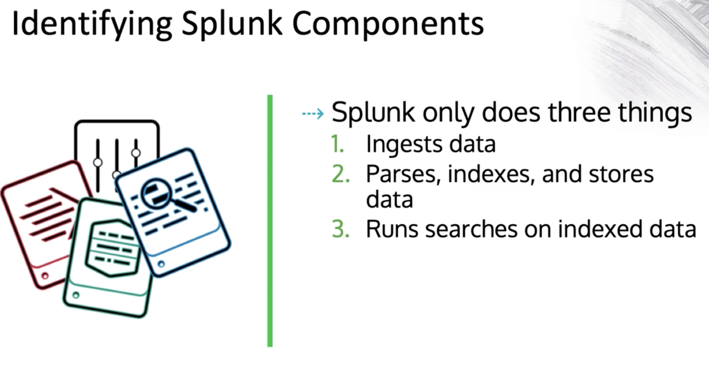
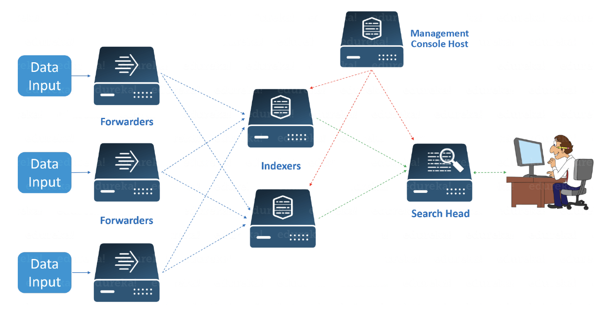
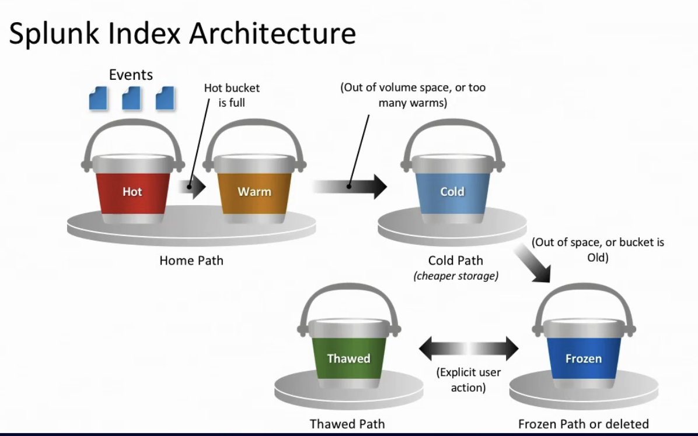
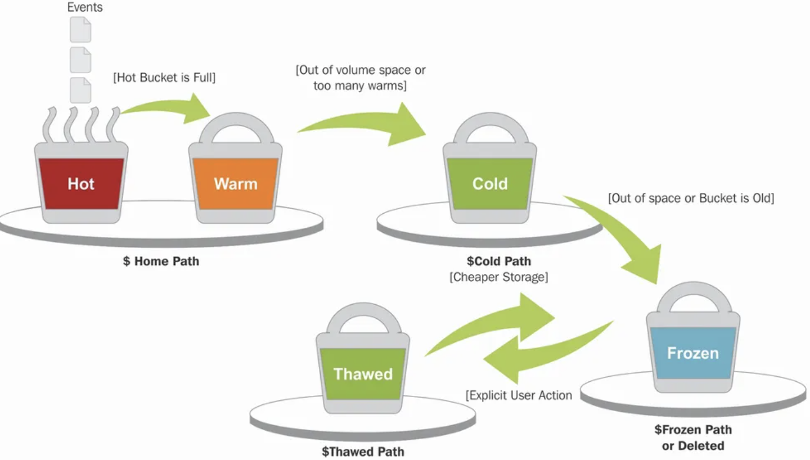

# poc

### Splunk accept data from various sources and Index it for further processing 


## No matter how take it but splunk in general serving these 3 purpose 



## Splunk Architecture 




# Splunk Components

## 1. Forwarders
- **Description**: Forwarders collect data from various sources and send it to the indexers.
  - **Universal Forwarders (UF)**: Lightweight and efficient for most data collection tasks.
  - **Heavy Forwarders (HF)**: Capable of parsing and indexing data before forwarding.

## 2. Indexers
- **Description**: Store and index data received from forwarders, transforming raw data into searchable events.
- **Functions**: Indexing, searching, and managing indexed data.

## 3. Search Heads
- **Description**: Allow users to search, analyze, and visualize data stored in the indexers.
- **Functions**: Query processing, result aggregation, and user interface for searching and reporting.

## 4. Deployment Server
- **Description**: Manages configurations and app deployments to multiple Splunk instances.
- **Functions**: Centralized configuration management and app deployment.

## 5. License Manager
- **Description**: Oversees Splunk license usage and ensures compliance with the purchased license volume.
- **Functions**: Monitoring and managing license usage.

## 6. Cluster Master (Cluster Manager)
- **Description**: Manages indexer clusters, ensuring data availability and recovery.
- **Functions**: Managing indexer cluster configurations, monitoring cluster health, and ensuring data replication.

## 7. Deployer
- **Description**: Distributes apps and configurations to search head clusters.
- **Functions**: Managing and deploying configurations across search head clusters.

## 8. Monitoring Console (MC)
- **Description**: Provides tools for monitoring and managing the health of Splunk deployments.
- **Functions**: Monitoring system health, performance metrics, and alerting on issues.

## 9. KV Store
- **Description**: A key-value store for storing and retrieving data as key-value pairs.
- **Functions**: Storage and retrieval of structured data.

## 10. Apps and Add-ons
- **Description**: Extend the functionality of Splunk for specific use cases, data sources, and integrations.
- **Functions**: Providing additional features, data inputs, and visualizations.


## Deployment models :- Mainly below 4 models are popularly used 

### Splunk deployment generally classified into four major types 

- Stand-alone deployment
- Distributed deployment
- Clustered deployment
- Cloud deployment

###  If we extend it to more then below are few options 


## 🏗️ Deployment Models

### 1. Standalone Deployment
- **Description**: A single Splunk instance that handles all aspects of data input, indexing, searching, and reporting.
- **Use Case**: Ideal for small environments, development, testing, or non-mission-critical use cases.

### 2. Distributed Deployment
- **Description**: Splunk is deployed across multiple instances to distribute different roles and workloads.
  - **Indexers**: Handle data indexing.
  - **Search Heads**: Manage search requests and distribute them to indexers.
  - **Forwarders**: Collect and forward data to indexers.
  - **Deployment Server**: Manages Splunk configurations across multiple instances.
- **Use Case**: Suitable for larger environments with high data volumes and complex search requirements.

### 3. Splunk Cloud
- **Description**: A SaaS offering where Splunk manages the infrastructure and operations, providing scalability and managed services.
- **Use Case**: Organizations looking for a cloud-native solution without the overhead of managing infrastructure.

### 4. Hybrid Deployment
- **Description**: Combines on-premises Splunk instances with Splunk Cloud to leverage the benefits of both.
- **Use Case**: Organizations needing the flexibility to keep certain data on-premises while utilizing cloud capabilities for other data.

### 5. Splunk Phantom Deployment
- **Description**: An orchestration, automation, and response (SOAR) platform that integrates with Splunk for security operations.
- **Use Case**: Organizations looking to automate and orchestrate their security operations workflows.

### 6. Splunk IT Service Intelligence (ITSI) Deployment
- **Description**: An analytics and IT monitoring solution built on top of Splunk Enterprise, offering advanced monitoring and alerting features.
- **Use Case**: Enterprises needing advanced IT operations analytics and monitoring.

### 7. Splunk Enterprise Security (ES) Deployment
- **Description**: A SIEM solution built on Splunk Enterprise, providing advanced security monitoring and threat detection capabilities.
- **Use Case**: Organizations with comprehensive security monitoring and compliance requirements.

### 8. Clustered Deployment
- **Index Clustering**
  - **Description**: Splunk uses multiple indexers to form a cluster that provides data replication, ensuring high availability and data recovery. Index clusters can be configured in replication factor (number of copies of data) and search factor (number of searchable copies).
  - **Use Case**: Organizations requiring high availability and disaster recovery for indexed data.
  
- **Search Head Clustering**
  - **Description**: Multiple search heads are grouped to provide high availability and load balancing for search requests. Search head clusters share the search workload and provide a unified view of search results.
  - **Use Case**: Environments with high search loads that need search request load balancing and high availability.


# Storing data in Splunk 

- Splunk store data in form of buckets in splunk server 
- there are 5 type of buckets we have in splunk 



- a better workflow of data in buckets 




## More info on Buckets 

# Splunk Buckets Overview 

In Splunk, buckets are logical containers that store indexed data. They represent different stages in the data lifecycle, and understanding the types of buckets is crucial for managing data retention, performance, and disk space. There are five main types of buckets in Splunk:

## Types of Buckets

### 1. Hot Buckets
- **Description**: Hot buckets are where new data is initially indexed. These buckets are actively being written to.
- **Characteristics**:
  - Frequently accessed and modified.
  - Reside in the `hot` directory.
  - When a hot bucket is rolled, it becomes a warm bucket.
- **Use Case**: Storing and indexing incoming data in real-time.

### 2. Warm Buckets
- **Description**: Once hot buckets are closed (rolled), they become warm buckets. Warm buckets are not written to but can still be read from.
- **Characteristics**:
  - Reside in the `warm` directory.
  - Frequently accessed for searches and reports.
- **Use Case**: Retaining recently indexed data that is still frequently queried.

### 3. Cold Buckets
- **Description**: After a configurable period, warm buckets are rolled to cold buckets. Cold buckets are stored on cheaper, slower storage.
- **Characteristics**:
  - Reside in the `cold` directory.
  - Accessed less frequently than hot and warm buckets.
- **Use Case**: Storing older data that is less frequently accessed but still within the retention period.

### 4. Frozen Buckets
- **Description**: Cold buckets eventually age out and are rolled to frozen buckets. By default, frozen buckets are deleted, but they can be archived if configured.
- **Characteristics**:
  - Reside outside of the Splunk index (archived or deleted).
  - No longer searchable within Splunk unless thawed.
- **Use Case**: Data retention policies dictate when data should be deleted or archived.

### 5. Thawed Buckets
- **Description**: If frozen buckets are archived, they can be brought back into Splunk as thawed buckets for searching.
- **Characteristics**:
  - Reside in the `thawed` directory.
  - Must be manually managed and restored from archive.
- **Use Case**: Restoring archived data for compliance, auditing, or analysis purposes.

## Bucket Lifecycle Summary
1. **Hot** → **Warm** → **Cold** → **Frozen** (and optionally **Thawed** if restored).

## Configuring Buckets
The transition between bucket stages is governed by Splunk’s index configuration settings, including size and time-based policies. Administrators can customize these settings to balance performance, storage costs, and data retention requirements.

### Example Index Configuration
```conf
# Example index.conf configuration
[my_index]
homePath = $SPLUNK_DB/my_index/db
coldPath = $SPLUNK_DB/my_index/colddb
thawedPath = $SPLUNK_DB/my_index/thaweddb
maxDataSize = auto_high_volume
maxHotBuckets = 10
maxWarmDBCount = 300
frozenTimePeriodInSecs = 7776000  # 90 days
