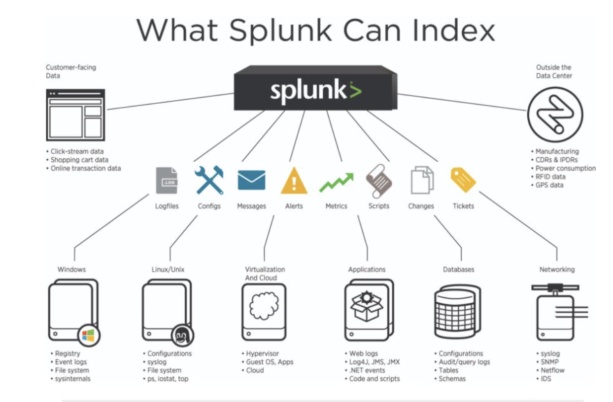

# poc

### Splunk accept data from various sources and Index it for further processing 

## Deployment models :- Mainly below 4 models are popularly used 

### Splunk deployment generally classified into four major types 

- Stand-alone deployment
- Distributed deployment
- Clustered deployment
- Cloud deployment

###  If we extend it to more then below are few options 

## 🏗️ Deployment Models

### 1. Standalone Deployment
- **Description**: A single Splunk instance that handles all aspects of data input, indexing, searching, and reporting.
- **Use Case**: Ideal for small environments, development, testing, or non-mission-critical use cases.

### 2. Distributed Deployment
- **Description**: Splunk is deployed across multiple instances to distribute different roles and workloads.
  - **Indexers**: Handle data indexing.
  - **Search Heads**: Manage search requests and distribute them to indexers.
  - **Forwarders**: Collect and forward data to indexers.
  - **Deployment Server**: Manages Splunk configurations across multiple instances.
- **Use Case**: Suitable for larger environments with high data volumes and complex search requirements.

### 3. Splunk Cloud
- **Description**: A SaaS offering where Splunk manages the infrastructure and operations, providing scalability and managed services.
- **Use Case**: Organizations looking for a cloud-native solution without the overhead of managing infrastructure.

### 4. Hybrid Deployment
- **Description**: Combines on-premises Splunk instances with Splunk Cloud to leverage the benefits of both.
- **Use Case**: Organizations needing the flexibility to keep certain data on-premises while utilizing cloud capabilities for other data.

### 5. Splunk Phantom Deployment
- **Description**: An orchestration, automation, and response (SOAR) platform that integrates with Splunk for security operations.
- **Use Case**: Organizations looking to automate and orchestrate their security operations workflows.

### 6. Splunk IT Service Intelligence (ITSI) Deployment
- **Description**: An analytics and IT monitoring solution built on top of Splunk Enterprise, offering advanced monitoring and alerting features.
- **Use Case**: Enterprises needing advanced IT operations analytics and monitoring.

### 7. Splunk Enterprise Security (ES) Deployment
- **Description**: A SIEM solution built on Splunk Enterprise, providing advanced security monitoring and threat detection capabilities.
- **Use Case**: Organizations with comprehensive security monitoring and compliance requirements.

### 8. Clustered Deployment
- **Index Clustering**
  - **Description**: Splunk uses multiple indexers to form a cluster that provides data replication, ensuring high availability and data recovery. Index clusters can be configured in replication factor (number of copies of data) and search factor (number of searchable copies).
  - **Use Case**: Organizations requiring high availability and disaster recovery for indexed data.
  
- **Search Head Clustering**
  - **Description**: Multiple search heads are grouped to provide high availability and load balancing for search requests. Search head clusters share the search workload and provide a unified view of search results.
  - **Use Case**: Environments with high search loads that need search request load balancing and high availability.

