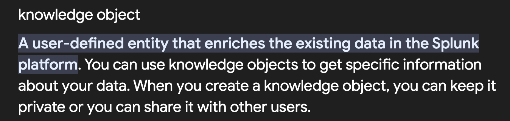

# Splunk Searching and Reporting Overview

### searching all the indexes 

### Using OR operator in index 

### matching some pattern using wild card 

## Knowledge Objects {KO's}

### Examples 

-- Getting an alert when i get 30 sales on my website is KO 
-- Getting an alert when a user is loggined on my website is an example of KO

