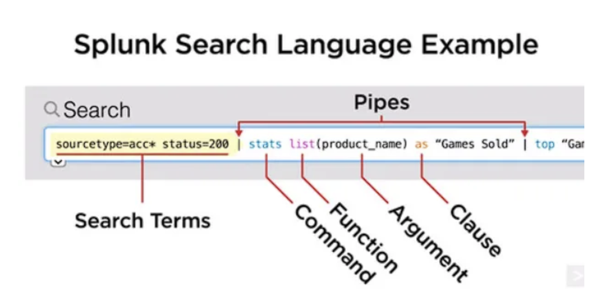

# Splunk Searching and Reporting Overview

## Introduction to Search 
- splunk uses SPL to search into indexed data



## Key Features of SPL

### 1. Search Commands
- **Basic Search**: The most fundamental command used to retrieve events from the index.

```
  index=_internal error
  index=web sourcetype=access_combined | rex "user=(?<user>\w+)"
  index=web status=200 | where bytes > 1000
  index=web | fields host, status, bytes
  index=web | stats count by status
  index=web | chart count by status
  index=web | timechart count by status
  index=web | bucket _time span=1h | stats count by _time
  index=web | transaction session_id
  index=web | eventstats avg(bytes) as avg_bytes
  index=web | lookup user_lookup user OUTPUT user_fullname
```


### searching all the indexes 


### Using OR operator in index 


### matching some pattern using wild card 


### counting uniq ip address using stats


### counting number of events in particular index 

```
source="MOCK_DATA.csv" host="DESKTOP-52F5653" index="findmore" sourcetype="csv" | stats count
```


## Knowledge Objects {KO's}

### Examples 

-- Getting an alert when i get 30 sales on my website is KO 
-- Getting an alert when a user is loggined on my website is an example of KO


