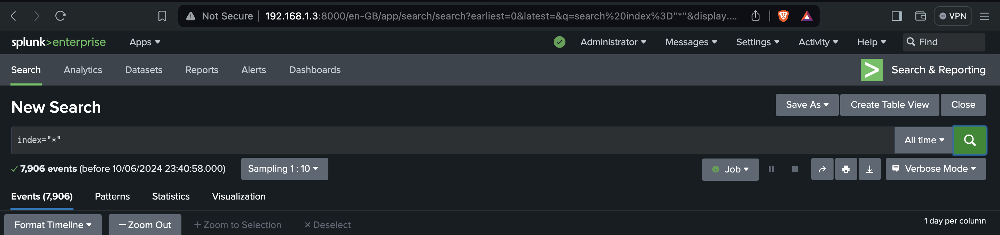
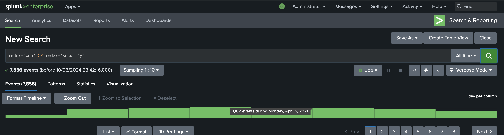

# Splunk Searching and Reporting Overview

## Introduction to Search 
- splunk uses SPL to search into indexed data


## Key Features of SPL

### 1. Search Commands
- **Basic Search**: The most fundamental command used to retrieve events from the index.

```
  index=_internal error
  index=web sourcetype=access_combined | rex "user=(?<user>\w+)"
  index=web status=200 | where bytes > 1000
  index=web | fields host, status, bytes
  index=web | stats count by status
  index=web | chart count by status
  index=web | timechart count by status
  index=web | bucket _time span=1h | stats count by _time
  index=web | transaction session_id
  index=web | eventstats avg(bytes) as avg_bytes
  index=web | lookup user_lookup user OUTPUT user_fullname
```


### searching all the indexes 



### Using OR operator in index 



### matching some pattern using wild card 


### counting uniq ip address using stats


### counting number of events in particular index 

```
source="MOCK_DATA.csv" host="DESKTOP-52F5653" index="findmore" sourcetype="csv" | stats count
```

### using OR , AND 

```
index="security" OR index="webapp"  host=web1 AND process=sshd
```

### explanation 

- OR will be used in first 2 keywords like in indexes 
- AND will be used in last 2 keywords like host and process

### printing uniq host count 

```
(index="security" OR index="webapp")   AND process=sshd | stats dc(host)
```

### printing uniq host name 

```
(index="security" OR index="webapp")   AND process=sshd | stats count by host
```

## printing values of all different host along with count 

```
(index="security" OR index="webapp")   AND process=sshd | stats values(host) dc(host)
```

### using Alias to rename column in above example 


### searching for oldest and newest time 

```
(index="security" OR index="webapp")   AND process=sshd | stats first(_time) , last(_time)

```

## Some specific commands in SPL 

### top/rare 
- they oposite to each other 
- to see most occuring items use top 
- to see least occuring items use rare 

### most frequently occuring processes

```
(index="security" OR index="webapp")  | top limit=10 process

```
### least occuring processes

```
(index="security" OR index="webapp")  | rare limit=4 process
```


### view 


## search / where command 

### Note: by default splunk is using search commnad 

```
search (index="security" OR index="webapp")  | stats count by host 
```

### printing uniq host which has occured more than 23000 times 

```
(index="security" OR index="webapp")  | stats count by host | where count>23000
```

## Timechart 
- in time chart time is always going to be in any of axis like either x or y

```
index="security" | timechart count
```

### events that happened more than 4000 times 

```
index="security" | timechart count | where count>4000
```

### check in span of 1 minute

```
index="security" | timechart span=1m count | where count>2000
```

# Regex 

### Understanding Regex token 


## Using regex to find 200 range status code in raw logs 

```
index="main" sourcetype="access_log-too_small" | regex _raw="\b(200|201|202|203|204)\b"
```
### matching and printing ip address

```
index="main" | rex field=_raw "^(?P<userIP>[^ ]+)" | table userIP
```

### another example 

```
index="main" | rex field=_raw "^(?<ip_address>\d{1,3}\.\d{1,3}\.\d{1,3}\.\d{1,3})" | stats count by ip_address | rename count as "Count of Events"
```

### find those IP tried to access 400 range http status code

```
index="main" | regex _raw="\s4\d{2}\s" |  rex field=_raw "^(?<ip_address>\d{1,3}\.\d{1,3}\.\d{1,3}\.\d{1,3})" | stats count by ip_address | rename count as "Count of Events"
```
### client ip with page and count 

```
index="main" | regex _raw="\s4\d{2}\s" | rex field=_raw "^(?<clientIP>\d{1,3}\.\d{1,3}\.\d{1,3}\.\d{1,3}) - - \[\d{2}/\w{3}/\d{4}:\d{2}:\d{2}:\d{2} [+-]\d{4}\] \"GET (?<page>.*?) HTTP/\d\.\d\"" | stats count by clientIP, page | rename count as access_count | sort - access_count
```
### OR 

```
index="main" | regex _raw="\s4\d{2}\s" | rex field=_raw "^(?<clientIP>\d{1,3}\.\d{1,3}\.\d{1,3}\.\d{1,3}) - - .* \"GET (?<page>.*?) HTTP/\d\.\d\"" | stats count by clientIP, page | rename count as access_count | sort - access_count
```

==> output 


# Creating Reports 

- to run commnads in a combo
- we get an options for running it at scheduled times 
- it can send alerts 

## Knowledge Objects {KO's}

### Examples 

-- Getting an alert when i get 30 sales on my website is KO 
-- Getting an alert when a user is loggined on my website is an example of KO


