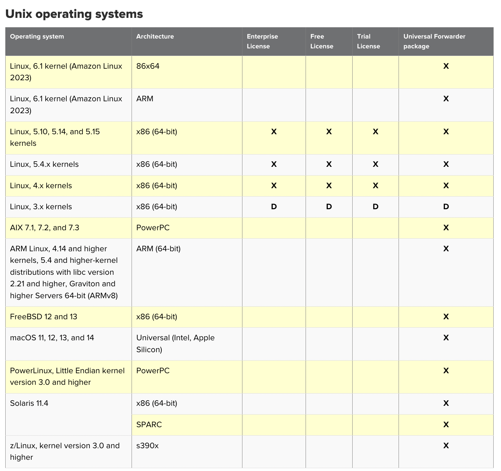
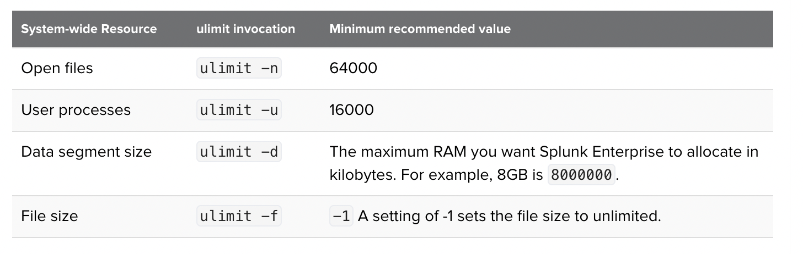
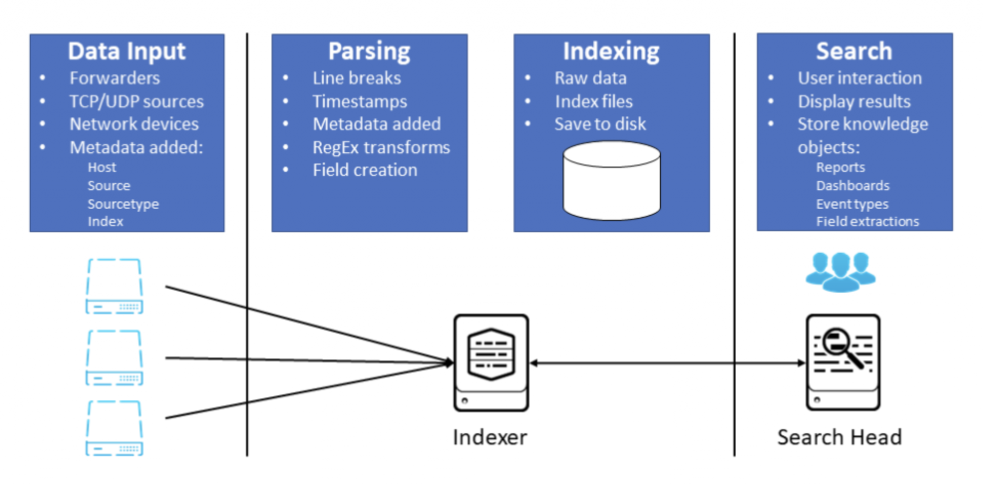
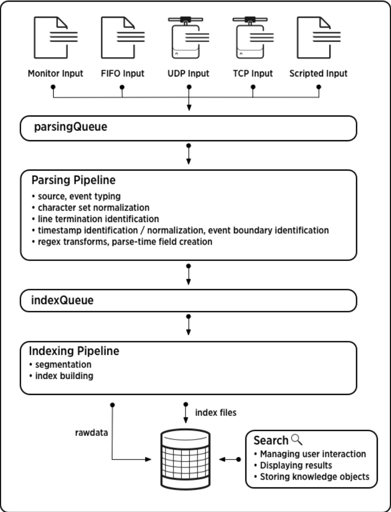

# Splunk Installation 

## Before doing Instalation you can check system requirements
[check_requirements](https://docs.splunk.com/Documentation/Splunk/latest/Installation/Systemrequirements)

# On Linux Platform 

## checking a generic system requirements for linux / unix

### check pointer 1 



### check pointer 2 




## Installing in any linux system as per above requirements 

- get the download url from splunk officail website after login with your account 
- [click_to_login](https://login.splunk.com/)

### Getting RPM linux after login 

```
 wget -O splunk-9.2.1-78803f08aabb.x86_64.rpm "https://download.splunk.com/products/splunk/releases/9.2.1/linux/splunk-9.2.1-78803f08aabb.x86_64.rpm"
```

### Installing it 

```
rpm -ivh splunk-9.2.1-78803f08aabb.x86_64.rpm 
```

### checking config file 

```
cd /opt/splunk/
[root@ip-172-31-62-84 splunk]# ls
README-splunk.txt  copyright.txt  lib               opt                splunk-9.2.1-78803f08aabb-linux-2.6-x86_64-manifest
bin                etc            license-eula.txt  quarantined_files  swidtag
cmake              include        openssl           share              var
[root@ip-172-31-62-84 splunk]# 

```

## Start splunk service 

```
[root@ip-172-31-62-84 bin]# /opt/splunk/bin/splunk start  --accept-license 

This appears to be your first time running this version of Splunk.

Splunk software must create an administrator account during startup. Otherwise, you cannot log in.
Create credentials for the administrator account.
Characters do not appear on the screen when you type in credentials.

Please enter an administrator username: admin
Password must contain at least:
   * 8 total printable ASCII character(s).
Please enter a new password: 
Please confirm new password: 

```

## Now you can access it using 8000 port 

## Data pipeline in splunk 

-- Understanding from data input to splunk search 



-- A better and more technical view 



