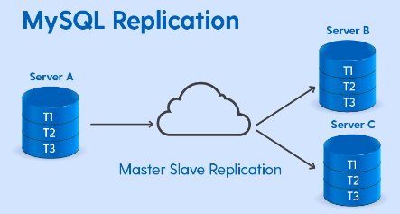

## getting started

### Mysql / mariadb  master & slave configuration 

### Master machine 

<ol>
    <li> It handle Read and Write both </li>
    <li>Changes in master will replicated to Slave </li>
</ol>

### Master slaves  

<ol>
    <li> It handle Read only operations </li>
    <li> Any changes in database on the master side will be replicating to slave </li>
</ol>

### Generic pic 

