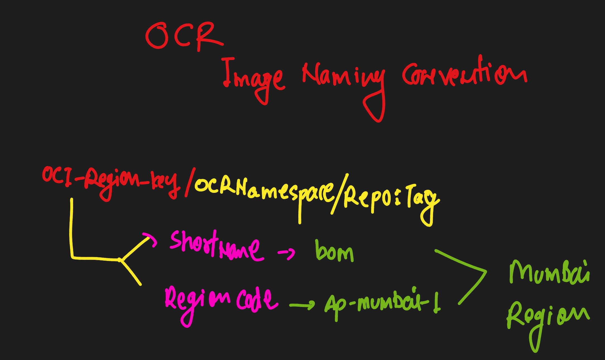

## Exploring Oracle cloud container Registry 

# Pushing docker image to OCR 

## OCR iamge name structure 




### tagging a docker image 

```
 docker tag  b6cbc18b7a82  ap-mumbai-1.ocir.io/bmfqoyqvmham/testimg:v1
```

## Note:  Please check that you have testimg Repo created in OCR 

### login to OCR using docker cli 

```
docker login ap-mumbai-1.ocir.io

username: bmfqoyqvmham/user1@gmail.com 
password: 
```

### pushing image 

```
docker push ap-mumbai-1.ocir.io/bmfqoyqvmham/testimg:v1

```


