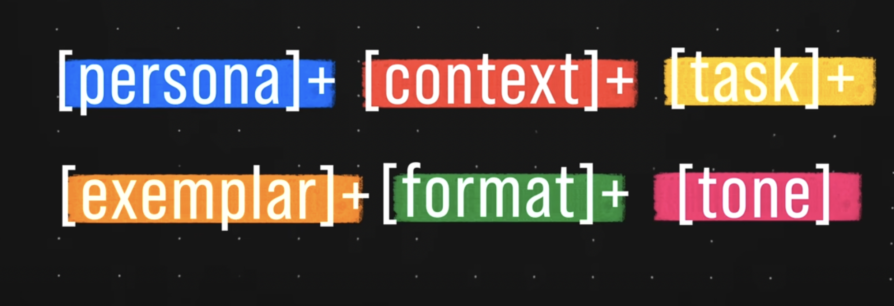

# Prompt Engineering

Prompt engineering is the process of designing and refining the instructions given to an AI language model (like me) to get the desired output. It's about crafting your input (the "prompt") in a way that the AI understands clearly and responds appropriately. Think of it like giving very specific directions to ensure you get the best possible answer or result from the AI.

## Key Concepts

1. **Clarity**: Ensure your prompt is clear and unambiguous. The more specific you are, the better the AI can understand your request.

2. **Context**: Provide enough context in your prompt. This helps the AI understand the background and give more relevant responses.

3. **Examples**: Use examples in your prompt to show the AI what kind of response you expect.

4. **Iterations**: Refine your prompts through trial and error. Experiment with different phrasings to see which one works best.

5. **Length**: Keep your prompts concise but informative. Too short might miss important details, too long might confuse the AI.

## Benefits

- **Improved Accuracy**: Well-crafted prompts lead to more accurate and relevant responses.
- **Efficiency**: Saves time by reducing the need for follow-up questions or clarifications.
- **Consistency**: Helps in getting consistent results across different interactions.

## Examples

- **Simple Prompt**: "Summarize the key points of the latest technology news."
- **Detailed Prompt**: "Summarize the key points of the latest technology news, focusing on advancements in AI and robotics, and explain their potential impact on the job market."

By understanding and applying these principles, you can effectively communicate with AI models and achieve better outcomes.

#  Designing Prompts is one of the High Demand skill in the market 
# Key points about Prompt 

- **The 6 Prompt components**:  
- **Order of Prompting is also very important**:

## Example of Prompt with correct order 

