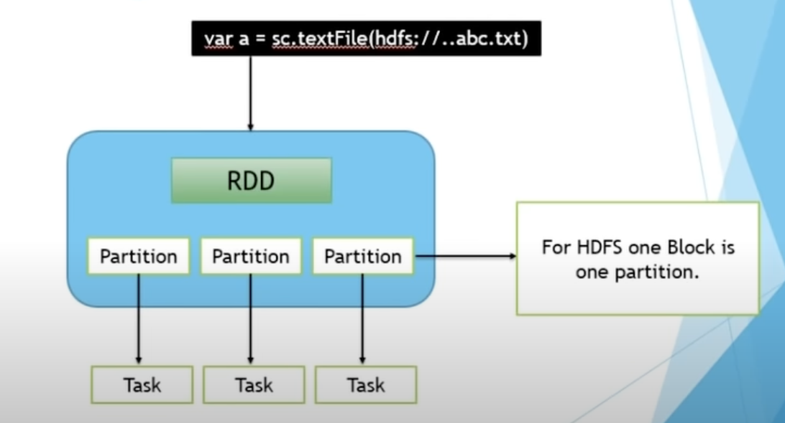
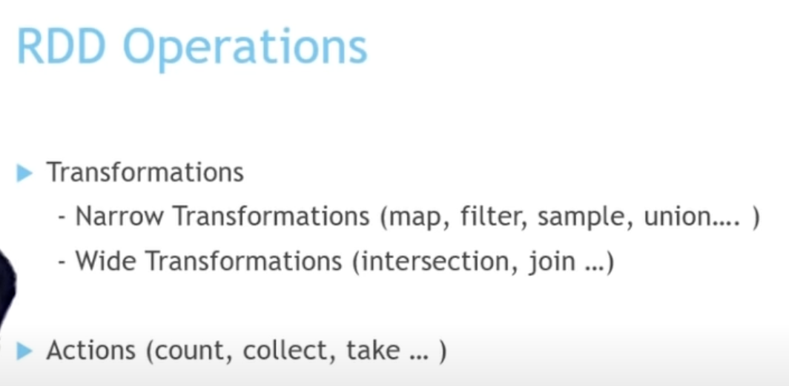
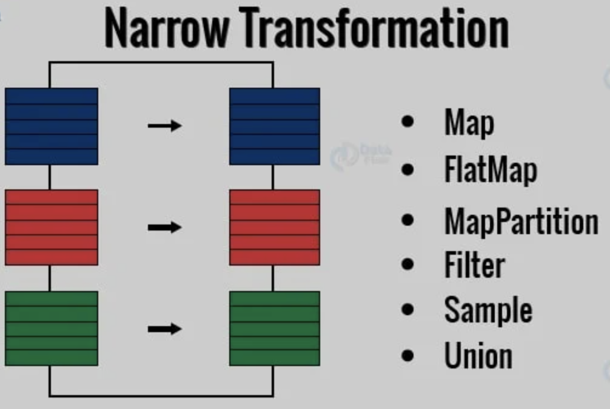
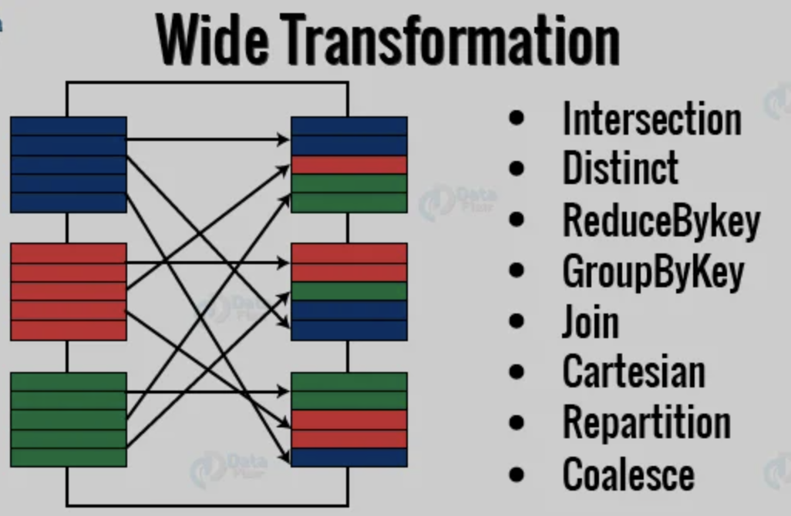

## Spark is Doing everything using RDD 

### Important point to Remember in RDD data is getting stored in partitioned format

### RDD is having  2 kind of operations 

<ol>
    <li> Transformation </li>
    <li> Action </li>
</ol>

### Example of Transformation and action methods

### Now Transformation is also having 2 types 

<ol>
    <li> narrow </li> ----->  Doing operation in ONE RDD (partition) -- and storing in just another RDD (partition)
    <li> Wide </li>  ------> Doing operation in ONE RDD (partition) -- and storing in many other  RDD (partition)
</ol>

### A visual Difference 

## Some Poluplar list of methods in Narrow transfromation 

### Narrorw Transformation 

### Wide Transformation

